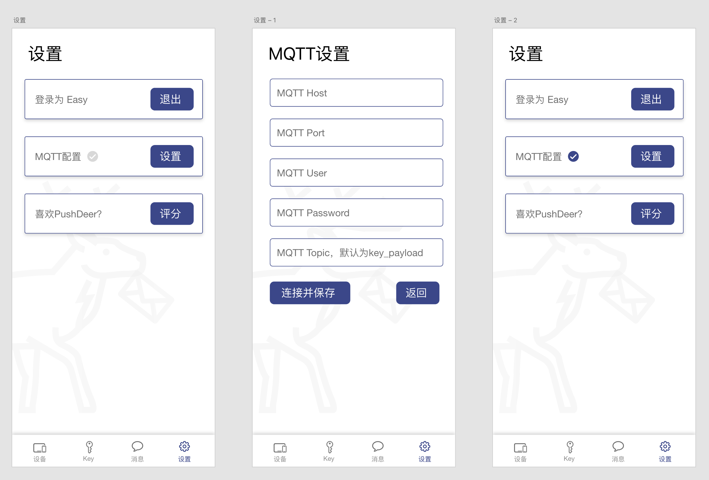

# 自架版当前状态

> 暂停开发，等待新开发者接手

由于之前负责Android版开发的同学忙于其他事情已退出开发，目前Android版需要新的同学参与，欢迎感兴趣的同学申请 easychen[A.T]gmail.com

# 问题

小米推送不再对个人开放，自架系统的推送权限申请很麻烦，而公开secret会对官方应用带来安全风险。

# 解决思路

采用websocket/MQTT来实现自架版的推送。

优点：

- 不受推送服务商限制，可以按自己需求随意推送

缺点：

- 无法实现后台推送，应用必须常驻后台。但考虑到MiPush在非小米系手机上也有同样的问题，也不是不能接受。

# 实现方案

优先采用MQTT协议，因为PushDeer自架版Docker镜像本来就已经支持了MQTT Server（ 可参考[此文档]配置 (https://github.com/easychen/pushdeer/tree/main/iot#%E5%BC%80%E5%90%AFmqtt%E6%9C%8D%E5%8A%A1) ），因此只需要在客户端实现即可。

以下是UI原型：

Android实现需要将MQTT启动为服务并常驻后台，可在顶栏显示一个常驻图标，点击后进入应用。