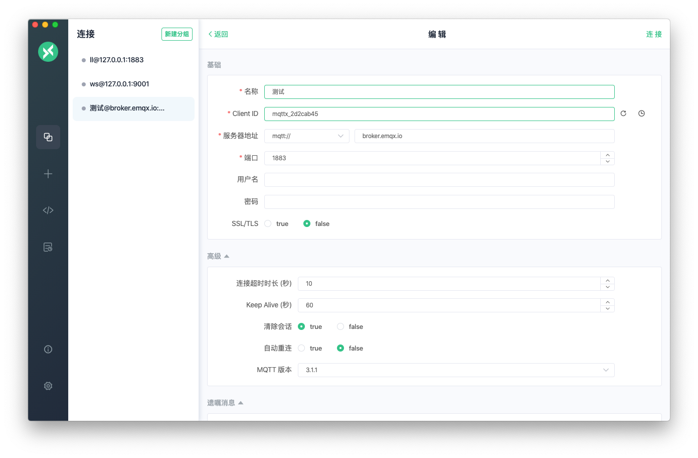
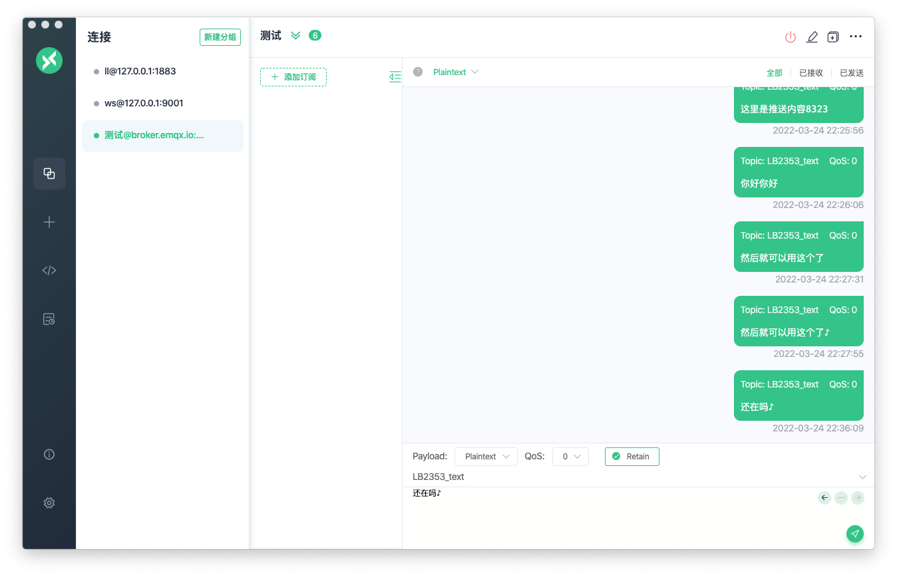

> PushDeer可以将消息推送到各种支持MQTT协议的智能设备。

DeerESP 是 PushDeer 在 IOT 方向的扩展项目，它是一个基于 ESP8266 的消息设备方案。

目前已经可以通过开发板自行组装使用。

本文将以 `NodeMCU` 1.0开发板和 1.44寸的 Arduino Black TFT屏幕为例，讲解如何组建一个成本35元人民币左右的硬件设备，并通过PushDeer将消息推送给它。

最终效果如下图：


[📼 点此查看视频版本，可以听到提示音♪](https://weibo.com/1088413295/LfUwivPoh)

PS：如果你有硬件量产的经验并有兴趣参与，可以在[微博](https://weibo.com/easy)私信或者评论@Easy。

## 硬件的购买


1. 开发板：只要是兼容NodeMCU1.0规范的就行，内存需要4M（32Mbits），更大更好（就能放中文字库了）我选的是CH340接口
1. 屏幕：[1.44寸黑色TFT](http://www.lcdwiki.com/zh/1.44inch_SPI_Arduino_Module_Black_SKU:MAR1442)，其他兼容ST7735驱动的屏幕也可以，但连线可能就不同了，需要自己配置屏幕库
1. 蜂鸣器（可选）：来消息时播放提示音

前边两个加上USB线，[淘宝33.30](https://item.taobao.com/item.htm?spm=a1z09.2.0.0.2c042e8dlNdY3E&id=531755241333&_u=gog6id51b2)，无源蜂鸣器：[淘宝3.3](https://detail.tmall.com/item.htm?id=41251333522&spm=a1z09.2.0.0.2c042e8dlNdY3E&_u=gog6id9820&skuId=4323951807546)。不认识店家，就随便搜了就买了。

## 硬件的连接

首先把屏幕和开发板连起来，按下图操作：


然后再把蜂鸣器和开发板连起来

|蜂鸣器|开发板|
|-|-|
|GND|G|
|VCC|3V|
|IO|D8|

如果你的连线不同，那么程序中的PIN值可能需要随之调整。

## 将开发板和电脑连起来

### 串口驱动安装

用USB线将开发板和电脑连起来，但这时候它们之间还不能通信，因为开发板用串口信号，电脑用USB信号，需要进行转换。

一般NodeMCU开发板上有自带转换芯片，比如CH3XX或者CPXXX，这里以CH340为例。去它们官网下载[最新的驱动](http://www.wch.cn/products/ch340.html)安装后，两者就能通信了。


## 配置开发环境

我们使用 `arduino` 开发环境进行开发，在此之前需要[下载并安装它的IDE](https://www.arduino.cc/en/software)。


由于我们使用的8266并没有内置到 `ardunio IDE` 中，我们还需要进行一下配置，在设置界面填上附加开发板管理器网址：`https://arduino.esp8266.com/stable/package_esp8266com_index.json`

> esp32 填写这个 https://raw.githubusercontent.com/espressif/arduino-esp32/gh-pages/package_esp32_index.json


然后选择 `工具`→`开发板`→`ESP8266 Boards`→`NodeMCU1.0`


再调整下开发板使用的串口：


要确认哪一个串口是开发板的很简单，你拔掉它就不见了…

这些准备工作做好以后，我们就可以将代码烧录到设备上了。但在这之前，我们需要把MQTT服务器架设起来，之后我们才能把账号等信息烧录进去。


## 使用MQTT接受PushDeer推送的消息

PushDeer自架版支持通过MQTT协议向兼容的设备（以下简称设备）发送信息，其主要工作原理是：

1. 自架版docker-compose文件中预置了MQTT服务器，手动开启后，设备可以通过配置的端口连接到服务器
1. 设备通过订阅主题实时获得消息，文字类型（text/markdown）消息主题为：`{{pushkey}}_text`， 图片类型的主题为`{{pushkey}}_bg_url`

### 开启MQTT服务

修改根目录下的 `docker-compose.self-hosted.yml`:

```yml
  app:
    #image: 'webdevops/php-apache:8.0-alpine'
    build: './docker/web/'
    ports:
      - '8800:80'
    volumes:
      - './:/app'
    depends_on:
      - mariadb
      - redis
    environment:
      - DB_HOST=mariadb
      - DB_PORT=3306
      - DB_USERNAME=root
      - DB_DATABASE=pushdeer
      - DB_PASSWORD=theVeryp@ssw0rd
      - GO_PUSH_IOS_TOPIC=com.pushdeer.self.ios
      - GO_PUSH_IOS_CLIP_TOPIC=com.pushdeer.self.ios.Clip
      - APP_DEBUG=false
      - MQTT_API_KEY=9LKo3
      - MQTT_ON=false <---- 这里改为 true 
      # 下边去掉注释
  # mqtt:
  #   image: 'ccr.ccs.tencentyun.com/ftqq/pushdeeresp'
  #   ports:
  #     - '1883:1883'
  #   environment:
  #     - API_KEY=9LKo3 <---- 这里和上边的MQTT_API_KEY值一致
  #     - MQTT_PORT=1883
  #     - MQTT_USER=easy <---- 自己起一个用户名
  #     - MQTT_PASSWORD=y0urp@ss <---- 自己起一个密码
  #     - MQTT_BASE_TOPIC=default  
```

修改完成后类似：

```yml
      - MQTT_API_KEY=2134grt
      - MQTT_ON=true
  mqtt:
    image: 'ccr.ccs.tencentyun.com/ftqq/pushdeeresp'
    ports:
      - '1883:1883'
    environment:
      - API_KEY=2134grt
      - MQTT_PORT=1883
      - MQTT_USER=mynameisLili
      - MQTT_PASSWORD=howoldareU
      - MQTT_BASE_TOPIC=default  
```

再通过以下命令启动服务：

```bash
docker-compose -f docker-compose.self-hosted.yml up --build -d
``` 

### 连接参数实例

这里以上边的设置为例，详细说明MQTT连接中用到的值，假设你的`Pushkey` 为 `PDU01234`，那么：

1. MQTT服务器的IP为你架设PushDeer服务的IP，注意127.0.0.1和localhost是环回地址，如果想其他设备能连接，至少需要局域网IP（设备在同一个局域网里）或者公网IP。
1. MQTT用户名为：`mynameisLili` （MQTT_USER）
1. MQTT密码为：`howoldareU`（MQTT_PASSWORD）

有了上边三个信息，你就可以连接上MQTT服务了。如果你不想要访问权限控制，可以这样：

```yml
      - MQTT_USER=
      - MQTT_PASSWORD=
```

连上服务器以后，还需要知道`topic`才能接收消息，你可以把它当成消息分组名称，只有订阅了这个分组，才能收到对应的消息。

当设置 `MQTT_ON=true` 以后，在发送信息时，PushDeer会抄送一份给MQTT，这样连接着的设备就可以收到消息了。为了方便设备进行消息处理，我们分两个分组抄送信息：

1. text/markdown类型的消息会通过`PDU01234_text`发送
1. image类型的消息会通过`PDU01234_bg_url`发送

## 烧录程序到设备

回到我们的设备这边来。首先用 `arduino IDE` 打开 `deeresp/deeresp.ino`，修改最上边的几行：

```cpp
#define WIFI_SSID "wifi名称"
#define WIFI_PASSWORD "wifi密码"
#define MQTT_IP "pushdeer公网IP"
#define MQTT_USER "MQTT用户名"
#define MQTT_PASSWORD "MQTT密码"
#define MQTT_TOPIC "PushDeer pushkey" // 这里填PushDeer的Key
#define MQTT_PORT 1883
```

这里的信息我们现在都有了，把它们替换掉，然后点击上传图标（向右的箭头），就会编译并烧录程序到设备上了。不过别急，有两个问题需要处理。


### 添加缺少的库

如果你在编译的过程中遇到了错误，那么多半是因为缺少库导致的。可以直接在IDE中搜索添加。以 `TJpg_Decoder` 库为例，点开`项目`→`加载库`→`管理库`。


在弹出的`库管理器`窗口里输入库的名字进行搜索，选择对应库并点击`安装`即可。


### 屏幕适配

我们使用了 `TFT_eSPI` 这个库来控制屏幕，它可以适配非常多的屏幕，但我们并没有在代码中告诉它我们用的屏幕是哪一款。这是因为，它要靠修改源代码目录的配置文件来实现的。

在首选项中找到`项目文件夹`位置。


打开该目录，然后找到 `User_Setup.h`文件。


注释掉默认驱动

```cpp
//#define ILI9341_DRIVER
```

将以下行之前的注释去掉：

```cpp
#define ST7735_DRIVER  
#define TFT_RGB_ORDER TFT_BGR 
#define TFT_WIDTH  128
#define TFT_HEIGHT 128
#define ST7735_GREENTAB3
#define TFT_CS   PIN_D1  // Chip select control pin D8
#define TFT_DC   PIN_D3  // Data Command control pin
#define TFT_RST  PIN_D2  // Reset pin (could connect to NodeMCU RST, see next line)
#define LOAD_GLCD   // Font 1. Original Adafruit 8 pixel font needs ~1820 bytes in FLASH
#define LOAD_FONT2  // Font 2. Small 16 pixel high font, needs ~3534 bytes in FLASH, 96 characters
#define LOAD_FONT4  // Font 4. Medium 26 pixel high font, needs ~5848 bytes in FLASH, 96 characters
#define LOAD_FONT6  // Font 6. Large 48 pixel font, needs ~2666 bytes in FLASH, only characters 1234567890:-.apm
#define LOAD_FONT7  // Font 7. 7 segment 48 pixel font, needs ~2438 bytes in FLASH, only characters 1234567890:-.
#define LOAD_FONT8  // Font 8. Large 75 pixel font needs ~3256 bytes in FLASH, only characters 1234567890:-.
//#define LOAD_FONT8N // Font 8. Alternative to Font 8 above, slightly narrower, so 3 digits fit a 160 pixel TFT
#define LOAD_GFXFF  // FreeFonts. Include access to the 48 Adafruit_GFX free fonts FF1 to FF48 and custom fonts
#define SMOOTH_FONT
#define SPI_FREQUENCY  27000000
#define SPI_READ_FREQUENCY  20000000
#define SPI_TOUCH_FREQUENCY  2500000
```

然后再打开同目录下的 `TFT_eSPI.h`，找到 `User_select.h`，打开注释：

```cpp
#include <User_Setup.h>
// #include <User_Setup_Select.h>
```

这些操作完成后再编译就会发现屏幕正常显示了。如果显示不正常（比如图片颜色、大小不对等），这有可能是因为你用的屏幕硬件规格和我们这里的不同，可以参照注释尝试修改那些配置项。

## 初始化SPIFFS文件系统

如果遇到图片显示不出来），串口提示`SPIFFS: mount failed`，这是因为文件系统没有初始化。

你可以下载一个arduino插件来解决这个问题：

- [ESP8266](https://github.com/esp8266/arduino-esp8266fs-plugin)
- [ESP32](https://github.com/me-no-dev/arduino-esp32fs-plugin) 

下载后按项目页面提示放到对应的目录，重启arduino IDE就可以从下边菜单中看到多出来的选项：


点击它就会自动创建文件系统，以后就不会再遇到错误提示了。


## 通过 PushDeer 推送信息到设备

当程序烧录完成，设备会初始化并自动连接服务器。如果没有初始化，可以按开发板上的reset进行重置。如果在烧录过程中串口无法连接开发板，也请按reset。

连接完成后可以看到「Waiting for message...」的提示。这时候我们就可以进行推送了。


推送直接使用 PushDeer 的API。

`POST /message/push`

|参数|说明|备注|
|-|-|-|
|pushkey|PushKey|
|text|推送消息内容|
|type|格式，选填|文本=text，markdown，图片=image，默认为markdown|

> ⚠️ 图片只能为256*256的JPG，否则显示会出问题

> ⚠️ 中文字库字库只有2000字，部分文字会乱码

> type 为 text 时，且 text 中包含 `♪` 字符时，蜂鸣器会发声

> type 为 image 时，text 中为要发送图片的URL

## 独立架设服务端

如果你希望为智能设备架设单一的服务端，可以单独使用 `pushdeeresp` 镜像：

```bash
docker run -e API_KEY=9LKo3 -e MQTT_PORT=1883 -e MQTT_USER=easy -e MQTT_PASSWORD=y0urp@ss -e MQTT_BASE_TOPIC=default -p 1883:1883 -p 80:80 ccr.ccs.tencentyun.com/ftqq/pushdeeresp 
```

启动后，支持`MQTT`和`HTTP`两种方式发送消息。

其中 `HTTP` 方式如下：访问 `IP/send` 即可发送消息，参数为：

|参数|说明|备注|
|-|-|-|
|key|API_key|用于限制权限访问|
|content|推送消息内容|
|type|格式，选填|文本=text，图片=bg_url，默认为text|
|topic|推送到主题，选填|会根据type推送到`${topic}_text`或`${topic}_bg_url`通道|

## 用MQTTX进行测试

在调试过程中，你可能需要推送消息进行测试，我们推荐你使用MQTTX来进行。

首先下载并安装[MQTTX](https://mqttx.app/zh)。


启动后创建一个新的连接，填入MQTT相关数据：




成功连接服务器后，就可以发送消息了。消息格式为纯文本，Topic为 `MQTT_TOPIC` + `_text`时发送文本；Topic为 `MQTT_TOPIC` + `_bg_url`时发送图片URL。




